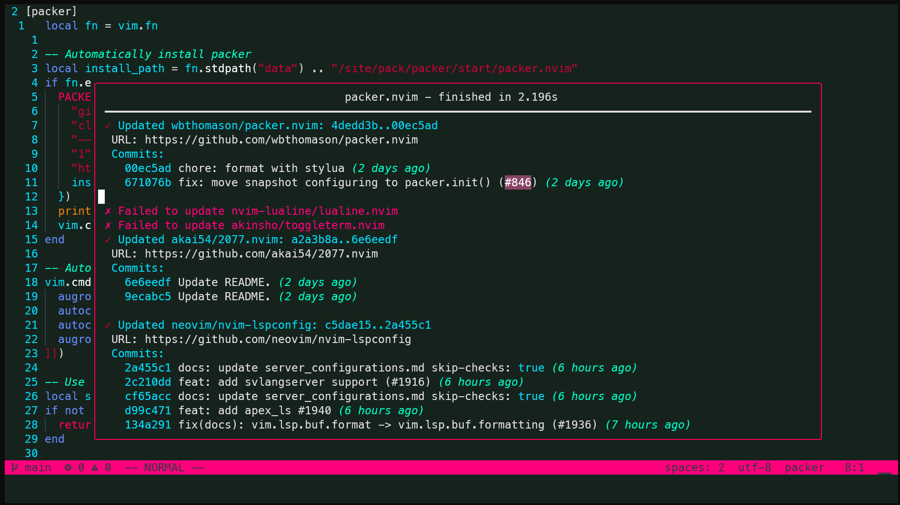
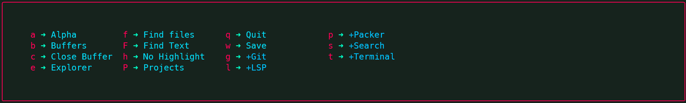
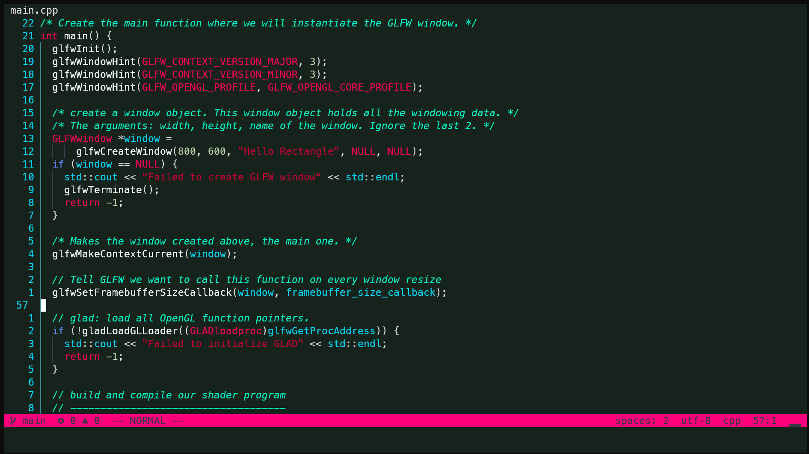
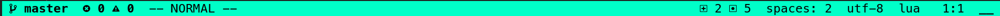
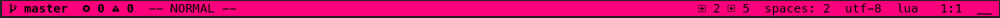

<h1 align="center">2077</h1>

<div align="center">
  Cyberpunk inspired color scheme written in Lua for <a href="https://github.com/neovim/neovim">Neovim</a>.
</div>

## 🚀Motivation

So at first I was using this [Darkplus](https://github.com/LunarVim/darkplus.nvim) color scheme, then I wanted something different, so I started searching and as I like Dark color schemes and I really like Cyberpunk design and colors, I tried to find a suitable color scheme for Neovim but, nada, nothing was really fascinating or convenient so I made my own.

## Supported Plugins

- [BarBar](https://github.com/wSzki/nvim_tabline)
- [Bqf](https://github.com/kevinhwang91/nvim-bqf)
- [DiffView](https://github.com/sindrets/diffview.nvim)
- [GitSigns](https://github.com/lewis6991/gitsigns.nvim)
- [Indent Blankline](https://github.com/lukas-reineke/indent-blankline.nvim)
- [Lir](https://github.com/tamago324/lir.nvim)
- [LSP](https://github.com/neovim/nvim-lspconfig)
- [Lualine](https://github.com/nvim-lualine/lualine.nvim)
- [nvim-cmp](https://github.com/hrsh7th/nvim-cmp)
- [NvimTree](https://github.com/kyazdani42/nvim-tree.lua)
- [Packer](https://github.com/wbthomason/packer.nvim)
- [Quickscope](https://github.com/unblevable/quick-scope)
- [Symbols-outline](https://github.com/simrat39/symbols-outline.nvim)
- [Telescope](https://github.com/nvim-telescope/telescope.nvim)
- [Treesitter](https://github.com/nvim-treesitter/nvim-treesitter)
- [Whichkey](https://github.com/folke/which-key.nvim)

## ⬇️ Installation

Install via package manager

```lua
-- Packer:
use 'akai54/2077.nvim'
```

##   Screenshots











## 🔥Contributions

Pull requests are welcome.
For major changes, please open an issue first to discuss what you would like to change.
